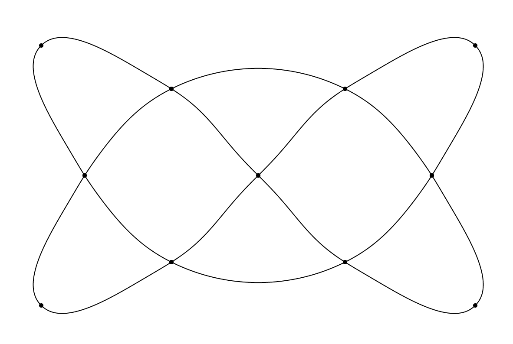

# splines

This is an implementation of the idea presented by Cem Yuksel in ["A Class of C2 Interpolating Splines"](https://dl.acm.org/doi/10.1145/3400301).
More information, and a live example can be found at http://www.cemyuksel.com/research/interpolating_splines/

The results are quite nice except that, as noted in the article, the maxmimum curvature is not exactly at the control points. In this example, this results in some undesirable waves in the diagonal lines. One workaround would be to detect straight-line (or close to straight) sections, and to insert extra control points.



This is a stripped-down version of the example implementation given by Yuksel at http://www.cemyuksel.com/research/interpolating_splines/curves.html. This version uses the plain canvas API rather than WebGL.

To get started, clone this repo, and then:

```
yarn install
yarn snowpack dev
```
